# Meeting Room Booking System

Internal meeting-room reservation platform with role-based access control (RBAC), conflict detection, calendar and list views, dashboard utilization insights, and Redis-backed availability caching.

---

## Table of Contents

1. [Purpose](#1-purpose)
2. [System Overview](#2-system-overview)
3. [Technology Stack](#3-technology-stack)
4. [High-Level Architecture](#4-high-level-architecture)
5. [Domain Model & Schema Design](#5-domain-model--schema-design)
6. [Application Modules](#6-application-modules)
7. [Authentication & Authorization](#7-authentication--authorization)
8. [Frontend Application](#8-frontend-application)
9. [Backend Application](#9-backend-application)
10. [API Reference](#10-api-reference)
11. [Caching](#11-caching)
12. [Validation & Business Rules](#12-validation--business-rules)
13. [Error Handling](#13-error-handling)
14. [Repository Structure](#14-repository-structure)
15. [Configuration & Deployment](#15-configuration--deployment)
16. [Operational Notes](#16-operational-notes)

---

## 1. Purpose

This application helps an organization reserve meeting rooms with clear ownership, capacity checks, and overlap prevention. It is designed for day-to-day office scheduling where multiple employees book shared rooms, and administrators control who can view, create, or manage bookings and users.

### Primary goals

| Goal | How the system supports it |
|------|----------------------------|
| Book rooms | Create reservations by user, room, date, time range, capacity, and reason |
| Avoid conflicts | Reject overlapping bookings for the same room on the same date |
| Match capacity | Only allow rooms whose capacity meets the required headcount |
| Control access | RBAC with Admin / Employee / Viewer and fine-grained permissions |
| Improve visibility | List, calendar, schedule grid, and dashboard utilization views |
| Speed availability checks | Redis cache for room-availability queries (60s TTL) |

### Actors

| Actor | Typical actions |
|-------|-----------------|
| **Viewer** | Log in, view rooms and bookings (read-only) |
| **Employee** | View rooms, create/update/delete bookings |
| **Admin** | All booking/room actions plus user listing, password reset, and role assignment |

### Out of scope / stubs

- Login audit logs (`GET /api/v1/users/logins` is a placeholder)
- Admin hard-delete of other users is stubbed; self-service account deletion uses `/auth/me`
- Server-side JWT blacklist on logout is not implemented (logout is client-oriented)

---

## 2. System Overview

The repository is a **monorepo** with two independently runnable applications that communicate over HTTP JSON APIs.

| Layer | Location | Responsibility |
|--------|-----------|----------------|
| Frontend | `frontend/` | Next.js UI, localStorage session, RTK Query client, permission-gated routes |
| Backend | `backend/` | FastAPI REST API, JWT auth, RBAC, booking/room/user services, Redis, PostgreSQL |

### End-to-end user journey

```mermaid
flowchart TD
    A[Visit app] --> B{Authenticated?}
    B -->|No| C[Register or Login]
    C --> D[Receive access + refresh JWT]
    D --> E[Store tokens / roles / permissions]
    B -->|Yes| F[Enter protected app]
    E --> F
    F --> G{Permission check}
    G -->|Denied| H[/unauthorized]
    G -->|Allowed| I[Dashboard / List / Calendar / Booking]
    I --> J[Check room availability]
    J --> K[Create or update booking]
    K --> L{Conflict or rule fail?}
    L -->|Yes| M[Show error / conflict alert]
    L -->|No| N[Persist booking + invalidate cache]
    N --> O[Refresh list / calendar]
```

### Seeded rooms (startup)

On API startup, the following rooms are inserted if missing:

| Room | Capacity | Room | Capacity |
|------|----------|------|----------|
| Ganga | 5 | Yamuna | 10 |
| Kaveri | 15 | Narmada | 20 |
| Saraswathi | 25 | Brahmaputra | 30 |
| Godavari | 35 | Krishna | 80 |
| Mahanadi | 40 | Sabarmati | 50 |
| Tapti | 60 | Indus | 70 |

---

## 3. Technology Stack

### Frontend

| Technology | Version / notes | Use |
|------------|-----------------|-----|
| Next.js | 15 (App Router) | Routing, pages, layouts |
| React | 19 | UI components |
| TypeScript | 5.x | Type safety |
| MUI + Emotion | 7.x | Component library & styling |
| Redux Toolkit + RTK Query | 2.x | API client, cache tags, token refresh |
| React Hook Form + Zod | — | Client-side form validation |
| FullCalendar / react-big-calendar | — | Calendar & schedule views |
| notistack | — | Toast / snackbar feedback |
| tsparticles | — | Landing-page motion |

### Backend

| Technology | Use |
|------------|-----|
| FastAPI | REST API framework |
| SQLAlchemy | ORM & session management |
| Alembic | Database schema migrations |
| PostgreSQL | Primary relational store (`DATABASE_URL`) |
| Redis | Availability (and booking-list key) caching |
| fastapi-jwt-auth | Access & refresh JWT handling |
| bcrypt | Password hashing / verification |
| Pydantic | Request/response schemas & validators |
| python-dotenv | Environment configuration |

### Local infrastructure defaults

| Service | Default |
|---------|---------|
| Frontend | `http://localhost:3000` |
| Backend API | `http://127.0.0.1:8000` |
| API prefix | `/api/v1` |
| OpenAPI docs | `/docs` |
| Redis | `localhost:6379` (db 0) |
| CORS origin | `http://localhost:3000` (credentials allowed) |

---

## 4. High-Level Architecture

### 4.1 System context

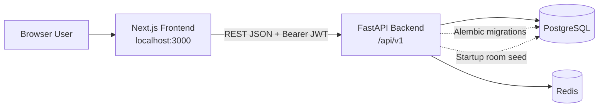

### 4.2 Logical component view

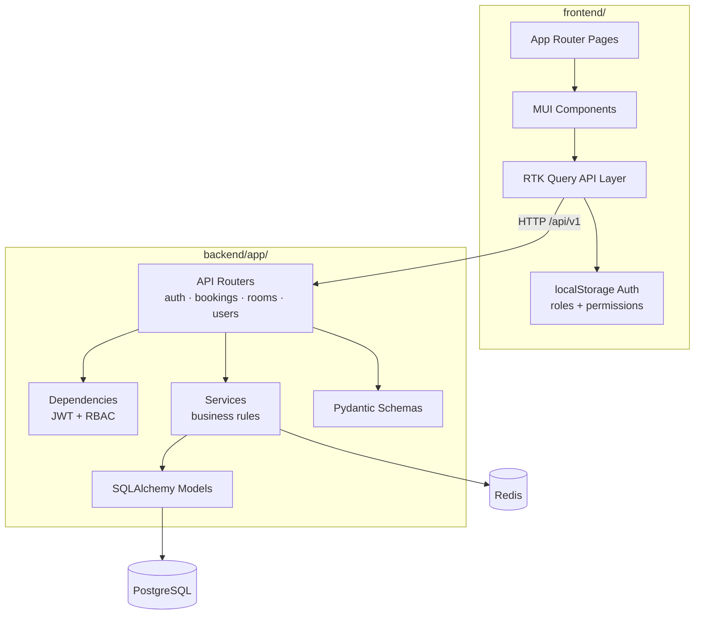

### 4.3 Authenticated request path

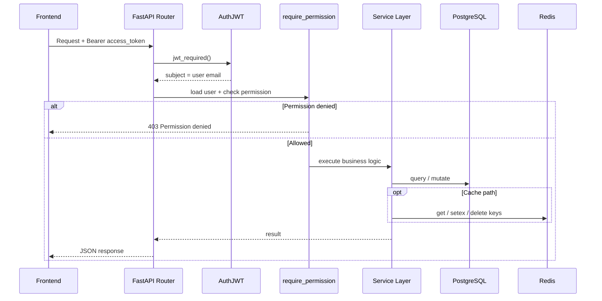

### 4.4 Token refresh path (frontend)

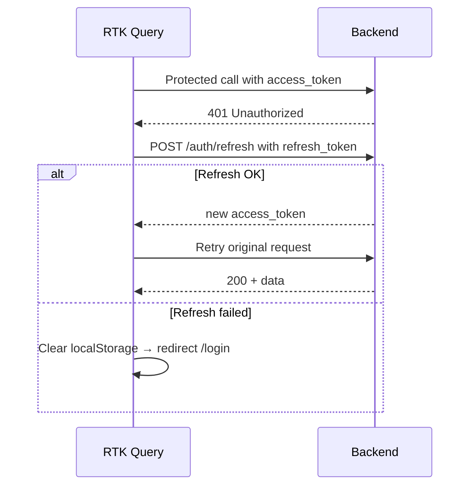

---

## 5. Domain Model & Schema Design

This section describes the relational model: entities, attributes, keys, relationships, and how Alembic evolves the schema.

### 5.1 Conceptual relationship diagram (ERD)

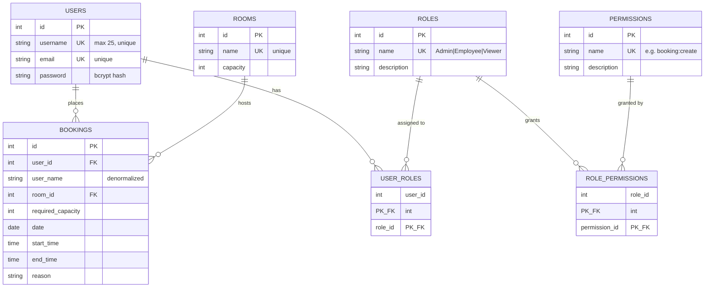

### 5.2 Physical schema model (tables & columns)

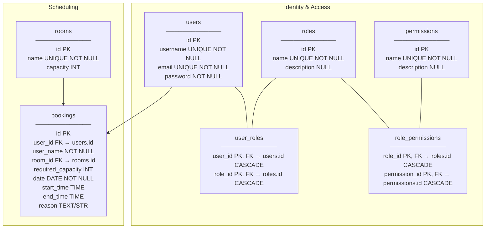

### 5.3 Cardinality summary

| Relationship | Cardinality | Join mechanism | Notes |
|--------------|-------------|----------------|-------|
| User ↔ Role | Many-to-many | `user_roles` | A user can hold roles; seed typically assigns one |
| Role ↔ Permission | Many-to-many | `role_permissions` | Permissions are checked via any of the user’s roles |
| User → Booking | One-to-many | `bookings.user_id` | `user_name` also stored for display/filter |
| Room → Booking | One-to-many | `bookings.room_id` | Overlap checks are scoped per room + date |

### 5.4 Table catalog (detailed)

#### `users`

| Column | Type | Constraints | Description |
|--------|------|-------------|-------------|
| `id` | Integer | PK, indexed | Surrogate key |
| `username` | String(25) | UNIQUE, NOT NULL | Display / booking identity |
| `email` | String(255) | UNIQUE, NOT NULL | Login subject for JWT |
| `password` | String(255) | NOT NULL | bcrypt hash |

#### `roles`

| Column | Type | Constraints | Description |
|--------|------|-------------|-------------|
| `id` | Integer | PK | Surrogate key |
| `name` | String(50) | UNIQUE, NOT NULL | `Admin`, `Employee`, `Viewer` |
| `description` | String(255) | NULL | Human-readable role purpose |

#### `permissions`

| Column | Type | Constraints | Description |
|--------|------|-------------|-------------|
| `id` | Integer | PK | Surrogate key |
| `name` | String(100) | UNIQUE, NOT NULL | e.g. `booking:create` |
| `description` | String(255) | NULL | Permission purpose |

#### `user_roles` (association)

| Column | Type | Constraints | Description |
|--------|------|-------------|-------------|
| `user_id` | Integer | PK, FK → `users.id` ON DELETE CASCADE | User side |
| `role_id` | Integer | PK, FK → `roles.id` ON DELETE CASCADE | Role side |

#### `role_permissions` (association)

| Column | Type | Constraints | Description |
|--------|------|-------------|-------------|
| `role_id` | Integer | PK, FK → `roles.id` ON DELETE CASCADE | Role side |
| `permission_id` | Integer | PK, FK → `permissions.id` ON DELETE CASCADE | Permission side |

#### `rooms`

| Column | Type | Constraints | Description |
|--------|------|-------------|-------------|
| `id` | Integer | PK, indexed | Surrogate key |
| `name` | String | UNIQUE, NOT NULL | Room display name |
| `capacity` | Integer | — | Max headcount |

#### `bookings`

| Column | Type | Constraints | Description |
|--------|------|-------------|-------------|
| `id` | Integer | PK, indexed | Surrogate key |
| `user_id` | Integer | FK → `users.id` | Booking owner |
| `user_name` | String | NOT NULL | Denormalized username for filters/UI |
| `room_id` | Integer | FK → `rooms.id` | Reserved room |
| `required_capacity` | Integer | — | Requested headcount |
| `date` | Date | NOT NULL | Booking calendar date |
| `start_time` | Time | — | Interval start |
| `end_time` | Time | — | Interval end (must be after start) |
| `reason` | String | NULL | Meeting purpose |

### 5.5 Keys, indexes & foreign keys

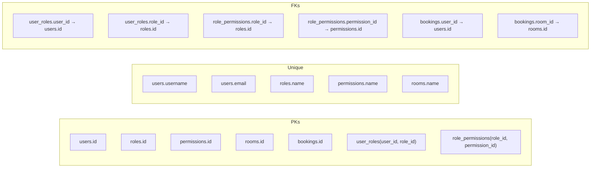

| Kind | Objects |
|------|---------|
| Primary keys | `users.id`, `roles.id`, `permissions.id`, `rooms.id`, `bookings.id`, composite PKs on association tables |
| Unique keys | `users.username`, `users.email`, `roles.name`, `permissions.name`, `rooms.name` |
| Foreign keys | `user_roles.*`, `role_permissions.*` (CASCADE delete), `bookings.user_id`, `bookings.room_id` |
| Indexes | PK / unique indexes; `users.id`, `bookings.id`, `rooms.id` marked indexed in models |

### 5.6 ORM relationship map (SQLAlchemy)

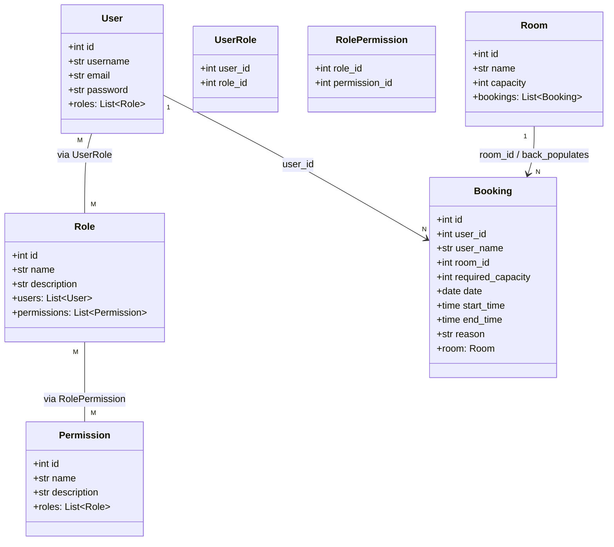

### 5.7 Booking conflict model (same room + date)

Two bookings conflict when intervals overlap:

```text
existing.start_time < new.end_time
AND existing.end_time > new.start_time
AND same room_id
AND same date
```

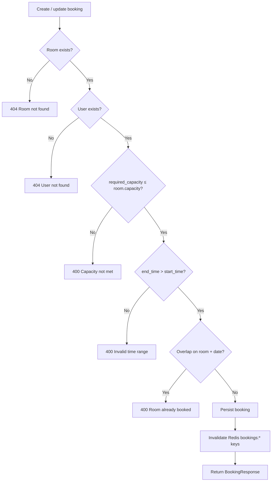

### 5.8 Alembic migrations

Migrations live under `backend/alembic/versions/`. Config: `backend/alembic.ini` (`script_location = alembic`, `prepend_sys_path = .`).

| Revision | Summary |
|----------|---------|
| `a91ebf200ae0` | Initial revision placeholder |
| `2a55225c1480` | Create bookings table |
| `527abd341448` | Add `date` and `reason` to bookings |
| `89f86778de38` | Add `user_id` to bookings |
| `9511dfd75501` | Adjust user identity fields on bookings |
| `7b17fa67ba7d` | Unique constraint on `rooms.name` |
| `61455e96d191` | Update user model |
| `26bc848b0350` | Broader schema / model updates |

**Commands** (from `backend/`):

```bash
alembic upgrade head
alembic revision --autogenerate -m "describe change"
alembic history
alembic downgrade -1
```

> The app also calls `Base.metadata.create_all()` on startup and seeds rooms. Prefer Alembic for schema evolution in shared or production environments.

---

## 6. Application Modules

### Backend modules

| Module | Path | Responsibility |
|--------|------|----------------|
| Entry | `app/main.py` | FastAPI app, CORS, routers, room seed, sequence fix |
| API routers | `app/api/` | HTTP endpoints: `auth`, `booking`, `room`, `user` |
| Services | `app/services/` | Business logic: booking conflicts, auth, users |
| Models | `app/models/` | SQLAlchemy entities |
| Schemas | `app/schemas/` | Pydantic DTOs |
| Core | `app/core/` | JWT, security, RBAC, Redis, config, dependencies |
| DB | `app/db/` | Engine, session factory, base metadata |
| Seeds | `app/seeds/` | Roles, permissions, mappings, admin assignment |

### Frontend modules

| Module | Path | Responsibility |
|--------|------|----------------|
| App routes | `src/app/` | Pages: home, login, booking, list, calendar, dashboard, users, unauthorized |
| Components | `src/components/` | Forms, lists, calendar, admin dialogs, layout, auth UI |
| Services | `src/services/api.ts` | RTK Query endpoints + reauth |
| Store | `src/store/` | Redux store + provider |
| Hooks / utils | `src/hooks`, `src/utils` | Auth helpers, permission checks |
| Theme | `src/Theme/` | Design tokens / theme |

### Module interaction (booking create)

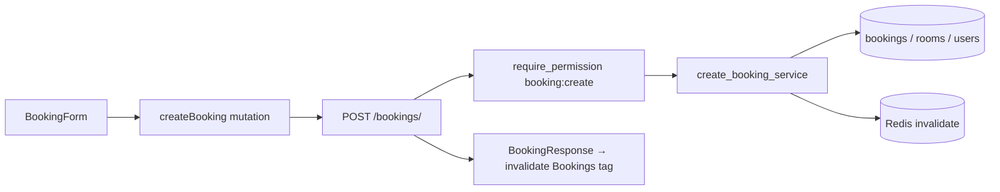

---

## 7. Authentication & Authorization

### 7.1 Authentication flow

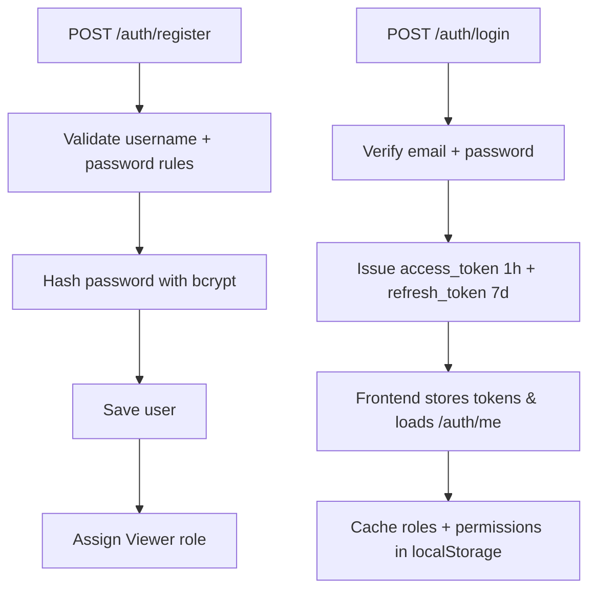

| Endpoint | Behavior |
|----------|----------|
| `POST /auth/register` | Create user; default **Viewer** role |
| `POST /auth/login` | Return `access_token` (3600s) + `refresh_token` (604800s) |
| `POST /auth/refresh` | Refresh JWT required; new access token (900s in handler) |
| `GET /auth/me` | Current user id, username, email, roles, permissions |
| `PUT /auth/me` | Update own profile |
| `DELETE /auth/me` | Delete own account |
| `POST /auth/logout` | Acknowledgement only (no server blacklist) |

JWT secret: `JWT_SECRET_KEY` (via `app/core/config.py`). Access token subject = user **email**.

### 7.2 RBAC model

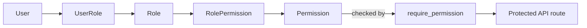

**Seeded permissions**

| Permission | Description |
|------------|-------------|
| `booking:view` | View bookings |
| `booking:create` | Create bookings |
| `booking:update` | Update bookings |
| `booking:delete` | Delete bookings |
| `room:view` | View rooms / availability |
| `user:view` | View users |
| `user:delete` | Delete users |
| `user:update` | Update users / reset passwords |

**Role → permission matrix**

| Permission | Admin | Employee | Viewer |
|------------|:-----:|:--------:|:------:|
| `booking:view` | ✓ | ✓ | ✓ |
| `booking:create` | ✓ | ✓ | |
| `booking:update` | ✓ | ✓ | |
| `booking:delete` | ✓ | ✓ | |
| `room:view` | ✓ | ✓ | ✓ |
| `user:view` | ✓ | | |
| `user:delete` | ✓ | | |
| `user:update` | ✓ | | |

Seed role assignment helper (`seed_admin`): `Root` → Admin, `Employee` → Employee, `Viewer` → Viewer.  
Only users with the **Admin** role may call `PUT /users/{id}/role`.

Frontend mirrors checks with `hasPermission()` and `<ProtectedRoute permission="..." />`.

---

## 8. Frontend Application

### 8.1 Route map

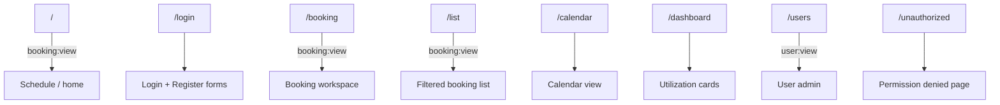

| Route | Purpose | Guard |
|-------|---------|-------|
| `/` | Home / schedule composition | `booking:view` |
| `/login` | Login & register | Public |
| `/booking` | Booking workspace | `booking:view` |
| `/list` | Booking list & filters | `booking:view` |
| `/calendar` | Calendar view | App page |
| `/dashboard` | Utilization / dashboard cards | App page |
| `/users` | User administration | `user:view` |
| `/unauthorized` | Permission denied | Public |

### 8.2 Key UI building blocks

| Area | Components |
|------|------------|
| Booking | `BookingForm`, `BookingModal`, `BookingList`, `BookingConflictAlert` |
| Schedule | `ScheduleGrid`, `CalendarToolbar`, `RoomUtilization`, `DashboardCards`, `FilterBar` |
| Auth | `LoginForm`, `RegisterForm`, `PasswordRules`, `AuthLayout` |
| Admin | `UserList`, `EditUserDialog`, `DeleteUserDialog` |
| Shell | `AppHeader`, `Navbar`, `UserMenu`, `ThemeToggle`, `AppLayout`, `ProtectedRoute` |
| Feedback | `StatusSnackbar`, skeletons |

### 8.3 Data layer

`src/services/api.ts` base URL: `http://127.0.0.1:8000/api/v1/`

Notable hooks: `useGetBookingsQuery`, `useCreateBookingMutation`, `useUpdateBookingMutation`, `useDeleteBookingMutation`, `useGetRoomsQuery`, `useGetAvailabilityQuery`, `useLoginMutation`, `useRegisterMutation`, `useGetMeQuery`, `useGetUsersQuery`, `useUpdateUserRoleMutation`, `useResetPasswordMutation`, profile mutations.

Cache tags: **`Bookings`**, **`Users`**.

### 8.4 Run

```bash
cd frontend
npm install
npm run dev
```

App: [http://localhost:3000](http://localhost:3000)

---

## 9. Backend Application

### 9.1 Entry & lifecycle

`app/main.py`:

1. Create FastAPI app + CORS for `http://localhost:3000`
2. `Base.metadata.create_all()`
3. Mount routers under `/api/v1`
4. On startup: seed rooms; sync PostgreSQL `bookings_id_seq`
5. Custom handler for `RequestValidationError` → `{ "detail": "<msg>" }`

### 9.2 Layering

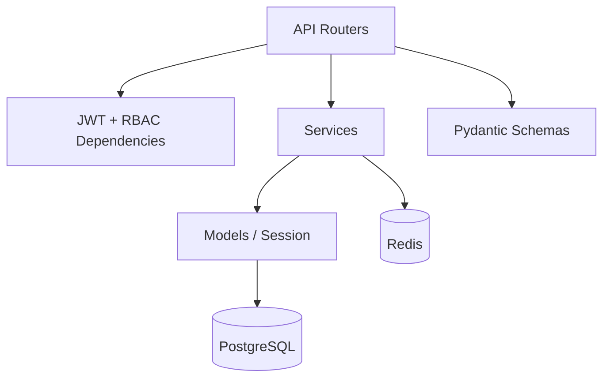

### 9.3 Seeds

```bash
cd backend
python -m app.seeds.run_seeds
```

Order: roles → permissions → role_permissions → assign Admin/Employee/Viewer to seed usernames.

### 9.4 Run

```bash
cd backend
# activate .venv, install deps, set .env
uvicorn app.main:app --reload --host 127.0.0.1 --port 8000
```

| URL | Purpose |
|-----|---------|
| `GET /` | Health message |
| `/docs` | Swagger UI |
| `GET /test-redis` | Redis ping (`ping` → `pong`) |

---

## 10. API Reference

Base path: **`/api/v1`**. Protected routes need `Authorization: Bearer <access_token>` unless noted.

### Auth — `/auth`

| Method | Path | Auth | Description |
|--------|------|------|-------------|
| POST | `/auth/register` | Public | Register (default Viewer) |
| POST | `/auth/login` | Public | Login; access + refresh tokens |
| POST | `/auth/refresh` | Refresh JWT | New access token |
| POST | `/auth/logout` | — | Logout acknowledgement |
| GET | `/auth/me` | Access JWT | Profile + roles + permissions |
| PUT | `/auth/me` | Access JWT | Update own profile |
| DELETE | `/auth/me` | Access JWT | Delete own account |

### Bookings — `/bookings`

| Method | Path | Permission | Description |
|--------|------|------------|-------------|
| POST | `/bookings/` | `booking:create` | Create booking |
| GET | `/bookings/` | `booking:view` | Paginated list (`user_name`, `room_name`, `date`, `reason`, `limit`, `offset`) |
| PATCH | `/bookings/{booking_id}` | `booking:update` | Partial update |
| DELETE | `/bookings/{booking_id}` | `booking:update` | Delete booking |

**Create body**

```json
{
  "user_name": "alice",
  "room_name": "Ganga",
  "required_capacity": 5,
  "date": "2026-08-13",
  "start_time": "14:30:00",
  "end_time": "15:30:00",
  "reason": "Sprint planning"
}
```

**List response**

```json
{
  "data": [
    {
      "id": 1,
      "user_name": "alice",
      "room_name": "Ganga",
      "required_capacity": 5,
      "date": "2026-08-13",
      "start_time": "14:30",
      "end_time": "15:30",
      "reason": "Sprint planning"
    }
  ],
  "total": 1
}
```

### Rooms — `/rooms`

| Method | Path | Permission | Description |
|--------|------|------------|-------------|
| GET | `/rooms/` | `room:view` | List rooms |
| GET | `/rooms/availability` | `room:view` | Available rooms for window + capacity |

Query params for availability:

| Param | Format / rule |
|-------|----------------|
| `start_time` | `HH:MM AM/PM` (e.g. `02:30 PM`) |
| `end_time` | Same format |
| `required_capacity` | Integer 1–99 |

### Users — `/users`

| Method | Path | Rule | Description |
|--------|------|------|-------------|
| GET | `/users/` | `user:view` | List users + roles |
| GET | `/users/registers` | `user:view` | Registered users wrapper |
| GET | `/users/logins` | `user:admin`* | Placeholder |
| POST | `/users/{id}/reset-password` | `user:view` | Reset password |
| PUT | `/users/{id}/role` | Admin role | Assign `Admin` \| `Employee` \| `Viewer` |
| DELETE/PUT `/{id}` | Stub | Redirected messaging toward `/auth/me` |

\* Ensure `user:admin` exists in seeds if you enable login logs.

---

## 11. Caching

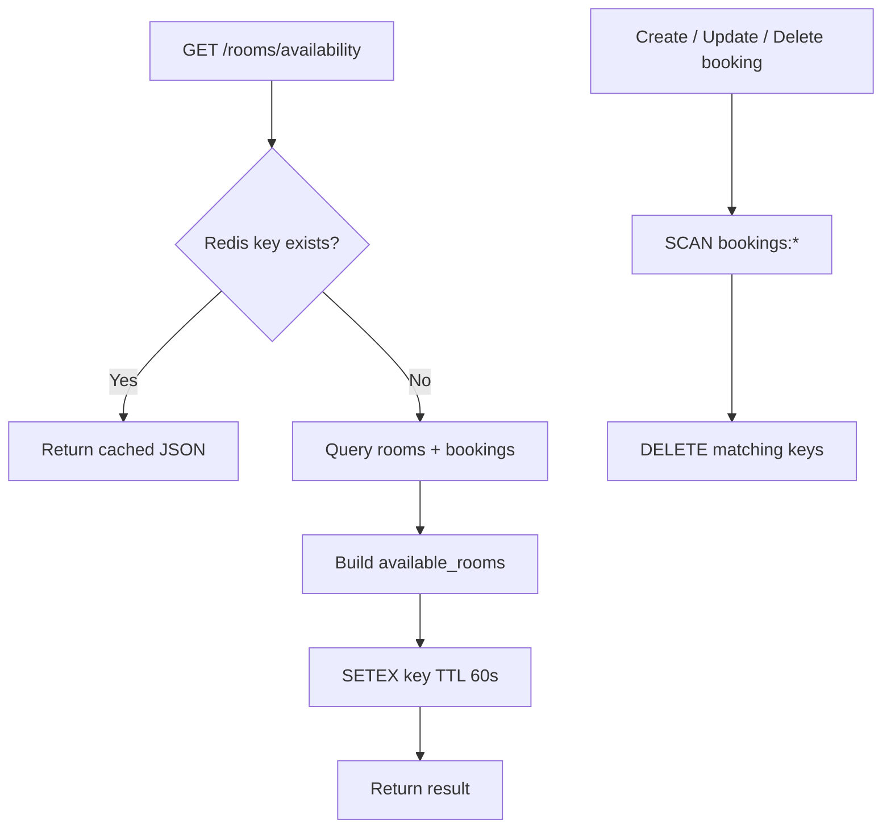

| Key pattern | Behavior |
|-------------|----------|
| `availability:{start}:{end}:{capacity}` | Cache miss → DB; then `SETEX` **60 seconds** |
| `bookings:*` | Cleared on booking create / update / delete |

Redis client: `localhost:6379`, `decode_responses=True`. Keep Redis running locally; availability and invalidation paths depend on it.

---

## 12. Validation & Business Rules

### Registration / password

| Rule | Detail |
|------|--------|
| Username length | 3–25 characters |
| Username charset | Letters, numbers, underscore only |
| Password length | ≥ 8 |
| Password complexity | Uppercase, lowercase, digit, special character |
| Uniqueness | Email and username must be unique |

### Booking rules

| Rule | Failure |
|------|---------|
| Room must exist (case-insensitive name) | 404 Room not found |
| User must exist (case-insensitive username) | 404 User not found |
| `required_capacity` ≤ room capacity | 400 Capacity not met |
| `end_time` > `start_time` | 400 Invalid time range |
| No overlap on same room + date | 400 Room already booked |

### Availability rules

- Capacity between 1 and 99  
- Times parse as `%I:%M %p`  
- Room listed if capacity ≥ required and no overlapping booking exists  

Frontend: React Hook Form + Zod; conflict alerts surface API 400 details.

---

## 13. Error Handling

| Status | Typical meaning |
|--------|-----------------|
| 400 | Business rule violation (capacity, overlap, bad password, bad time format) |
| 401 | Missing/invalid JWT or user not found for token subject |
| 403 | Permission denied / non-admin role change |
| 404 | Room, user, booking, or account not found |
| 422 | Validation error → `{ "detail": "<first message>" }` |
| 500 | Unexpected server / database error |

Services raise `HTTPException` with clear `detail` strings. Routers catch unexpected exceptions, log them, and return 500 where appropriate.

---

## 14. Repository Structure

```text
.
├── Readme.md
├── .gitignore
├── backend/
│   ├── alembic.ini
│   ├── alembic/
│   │   └── versions/              # migration scripts
│   ├── app/
│   │   ├── main.py                # FastAPI entry
│   │   ├── api/                   # auth, booking, room, user
│   │   ├── core/                  # config, JWT, RBAC, Redis, security
│   │   ├── db/                    # engine, session, base
│   │   ├── models/                # SQLAlchemy models
│   │   ├── schemas/               # Pydantic schemas
│   │   ├── services/              # business logic
│   │   └── seeds/                 # RBAC + admin seeding
│   └── .venv/
└── frontend/
    ├── package.json
    ├── next.config.ts
    ├── tsconfig.json
    └── src/
        ├── app/                   # App Router pages
        ├── components/
        ├── hooks/
        ├── services/              # RTK Query API
        ├── store/
        ├── Theme/
        ├── types/
        └── utils/
```

---

## 15. Configuration & Deployment

### Environment (backend)

Create `backend/.env` (never commit secrets):

| Variable | Purpose |
|----------|---------|
| `DATABASE_URL` | SQLAlchemy PostgreSQL connection string |
| `JWT_SECRET_KEY` | Secret used to sign JWTs |

Redis host/port are currently hard-coded to `localhost:6379` in `app/core/redis_client.py`.

### Local bring-up

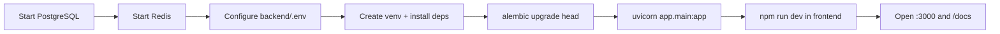

1. Start PostgreSQL and create the app database  
2. Start Redis on port 6379  
3. Configure `backend/.env`  
4. Create/activate Python venv; install backend dependencies  
5. Run `alembic upgrade head`  
6. Start API: `uvicorn app.main:app --reload --port 8000`  
7. Register users, then `python -m app.seeds.run_seeds` (for seed username role assignment)  
8. Start UI: `cd frontend && npm install && npm run dev`  
9. Open [http://localhost:3000](http://localhost:3000) and [http://127.0.0.1:8000/docs](http://127.0.0.1:8000/docs)

### Production notes

- Rotate `JWT_SECRET_KEY`; never ship development secrets  
- Restrict CORS `allow_origins` to the real frontend origin  
- Run Alembic migrations before deploying API changes  
- Put HTTPS reverse proxy in front of uvicorn / Next.js  
- Monitor Redis TTL vs booking volume for stale availability windows  

Frontend API base URL is in `frontend/src/services/api.ts` — update for non-local hosts.

---

## 16. Operational Notes

| Topic | Detail |
|-------|--------|
| Room seed | Missing named rooms are inserted on startup; restarts do not wipe existing rooms |
| Booking sequence | Startup resets PostgreSQL `bookings_id_seq` to `MAX(id)` to avoid PK conflicts after restores |
| Default role | New registrations get **Viewer**; Admin must promote for write access |
| 403 UX | API returns `"Permission denied"`; UI redirects guarded pages to `/unauthorized` |
| Cache freshness | Booking mutations clear `bookings:*`; availability keys expire in 60s (brief stale window possible) |
| Ownership enforcement | Delete/update ownership branches are incomplete/disabled — follow-up if Employees must only mutate their own bookings |
| Exploration | Use Swagger at `/docs` with a Bearer token from `/auth/login` |

### Quick reference

| Item | Value |
|------|--------|
| Frontend | `http://localhost:3000` |
| Backend | `http://127.0.0.1:8000` |
| API prefix | `/api/v1` |
| OpenAPI | `/docs` |
| Redis test | `GET /test-redis` |
